Table Assembly Tutorial
============
A very simple subassembly task using the FreeCAD Assembly 4 Workbench
----------

Our table has just three component types:

1. table top
1. leg
1. foot

We will make a sub-assembly from the leg and the foot, then add four of these to the table top.

Set up the files:
==================
Create the following five files, saving them in the same directory for convenience:

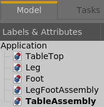

---------------------
Create the table top:
=======================

Switch to the TableTop tab at the bottom of your window: 

Choose the Assembly 4 workbench   and create a new Body  leaving the default name "Body".

Expanding our model tree, it now looks like this:

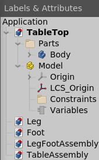

Right-click on the Body in the tree:

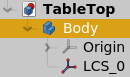
and select "Toggle active body".
This will change you out of the **Assembly 4** workbench to the **Part Design** workbench. 

Click on the New Sketch button: .  Select "XY_Plane001 (Base Plane)" from the dialog and hit OK.

Create the following sketch of approximately 600mm x 400mm small table top:
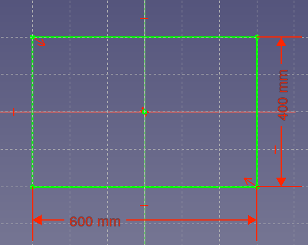

Constrain the corners to the centre with a symmetry constraint.  (Select the two corners, then the origin, and hit the 's' key).

Hit ESC or OK and pad the selected sketch  by 20mm, then zoom out to see your part:

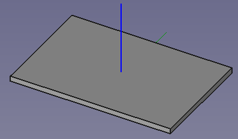

Save the *TableTop* file.

--------------------------
Create the leg
=================

Follow the same procedure as above to create the table leg, with sketch dimensions of 40x40mm and pad height of 300mm.
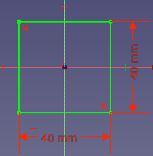

As per the table, constrain the corners to the centre with a symmetry constraint.  (Select the two corners, then the origin, and hit the 's' key). This will allow us to use the default Local Co-ordinate System to attach the foot to the centre of the leg later.

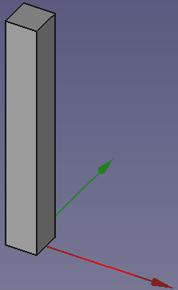

Our leg model tree should now look like this:

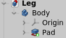

Save the *Leg* file.

----------------------

Create the foot:
===================

Repeat the procedure again, this time creating a circular sketch with a 60mm diameter:

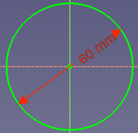

Constrain the sketch centrepoint to the origin (select both points and hit 'c' for coincident)

This time, when you create the pad feature, make it **10mm**, and reverse the direction so that the solid is below the origin:

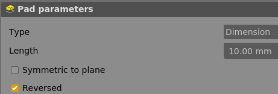

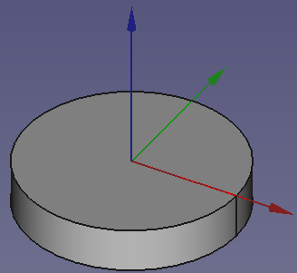

When we attach the top of the foot to the bottom of the leg, we can use the origin without needing to add another Local Co-ordinate System.

Save the *Foot* file.

------------------------

Create the leg and foot assembly:
=====================

To enable file model names to appear in the assembly windows, close all the files and re-open them.

For the LegFootAssembly, add a Model .  We don't need a Body in the assembly as we did in the *Leg* and *Foot* (though it won't do any harm).

Select the *LegFootAssembly* tab (at the bottom of the window)

to activate the file.

Create a new Assembly 4 model. 

From the Assembly 4 workbench toolbar, select "*Insert part into the assembly*".  

Choose **Leg#Body** and click OK.

Repeat for the foot, choosing **Foot#Body**.

Because we chose the pad direction for the leg to be **up** from the origin, and the pad direction for the foot to be **down**, the parts automatically align correctly, each with its origin at the assembly origin:

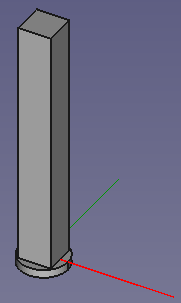

Save the *LegFootAssembly* file.

-------------------------

Create the table assembly:
============================

Activate the *TableAssembly* file: 

Add a model  only.  As with the foot assembly, a Body is not required.

Insert the *TableTop* part into the assembly
-------------

From the Assembly 4 workbench toolbar, select *Insert part into the assembly*.  

Select **TableTop#Body** and hit OK.
This will insert the *TableTop* part at the origin.

Insert the *LegFootAssembly*
-------------

Insert  the leg and foot assembly in the same way by choosing **LegFootAssembly#Model**.

This also inserts the assembly by default at the origin:

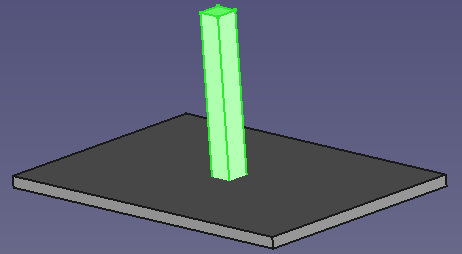

We need to attach it to the corner of the table.  For this, we need to create **Local Co-ordinate Systems** (LCS), four on the *TableTop* and a matching one on the *LegFootAssembly*.

**Create the *TableTop* LCSs:**

Open the *TableTop* file, select the **Body** in the tree and click "Create new co-ordinate system in part."  from the Assembly 4 workbench.

Rename it to "LCS\_Leg1"

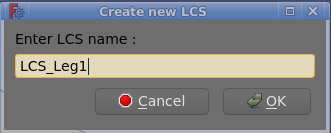

This will place our new LCS at the origin:

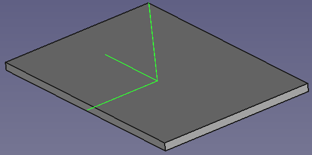

Move it to the corner where we want to attach the leg as follows:

Right-click on the LCS in the model tree:

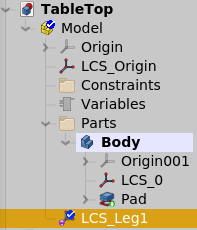

Select "Edit Datum" to bring up the Co-ordinate system parameters dialog.

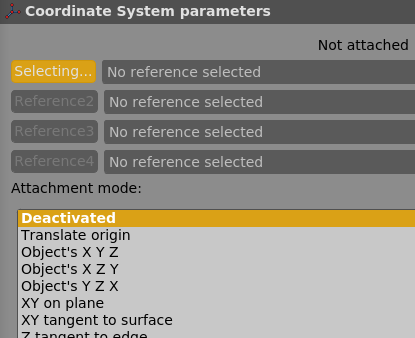

In the order shown by 1,2 and 3 below, select the **vertices** at the bottom corners of the table top:

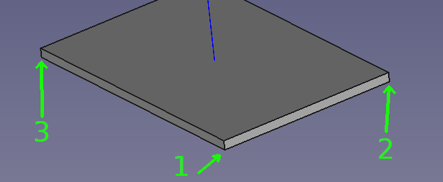

Next, select the Attachment mode "**Align O-X-Y**" to indicate that the three points we just selected should be the Origin, X-axis direction and Y-axis direction of our new LCS.

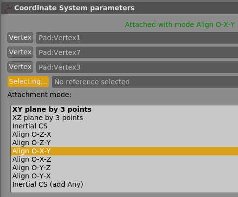

This will align the new LCS as shown:

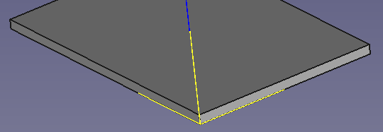

**\*Note:** If you have a high-res screen, it may be easier to select the vertices if you increase the pick radius:
*Edit -> Preferences -> Display -> Colours(yes!) -> Pick radius*

Add LCS\_Leg2, LCS\_Leg3 and LCS\_Leg4 in the same way, rotating the table top each time.

**\*Note:** Ensure you select three **vertices** each time for your Origin, X-direction and Y-direction, and not one of the other LCSs you just created.

Our part should now look like this:

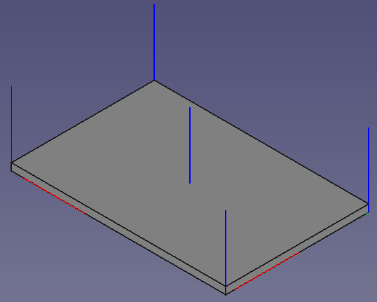

Also check that your LCSs are created at the root of the Body tree as shown:

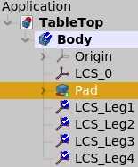

If you want to import an LCS into another assembly later, it must be at the root level.

**Create the LegFootAssembly LCS:**

It is not possible to position an LCS in an assembly, so we instead create an LCS in the *Leg* part and **import** it into the *LegFootAssembly*.

Activate the *Leg* part: 

Click Create new co-ordinate system in part. 

Rename it to "LCS\_TopCorner".
This will place it at the origin as shown:

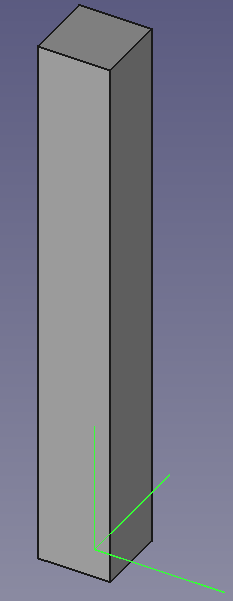

Right click on the new LCS in the model tree:

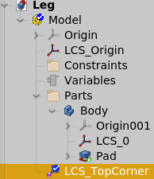

and select "Edit datum".

As before with the *TableTop*, select the three corners and choose attachment mode **O-X-Y**.  This time, choose the corners at the **top** of the leg, so that the top of the *Leg* will attach to the bottom of the *TableTop*.

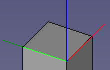

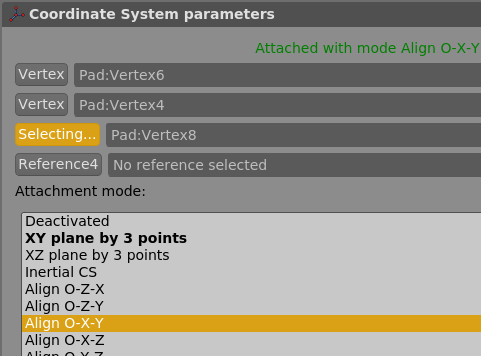

Hit OK and save the *Leg* file.

Activate the *LegFootAssembly* file, where you will now see the new LCS.

Select the new LCS in the model tree of the *LegFootAssembly*:
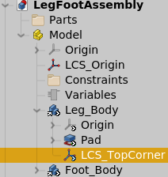

Click "Import datum object"  and keep the default settings:

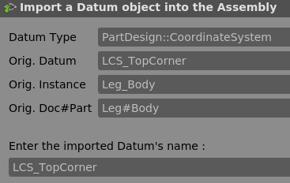

We can now see a copy of the datum object in the *LegFootAssembly* tree:

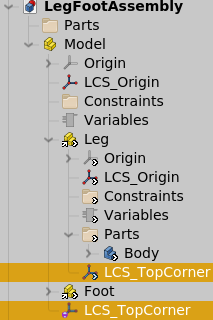

Activate the *TabelAssembly* file: 

Select the LegFootAssembly in the model tree:

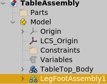

Click "Move/Attach a part in the assembly" 

In the following dialog, select Attach to: TableTop.
Under "Select LCS in Part:" choose LCS\_TopCorner.
Under "Select LSC in Parent:" choose LCS\_Leg1

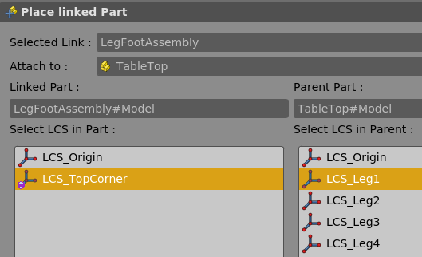

This aligns the two parts by aligning the co-ordinate systems we created.

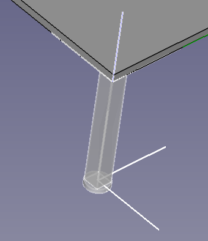

Hit OK, and then repeat for the other three legs, renaming them as you go to LegFootAssembly_2, etc.

The finished product won't win us any Furniture Industry Association awards, but at least we can now make assemblies and sub-assembles with Zolko's Assembly 4 workbench.

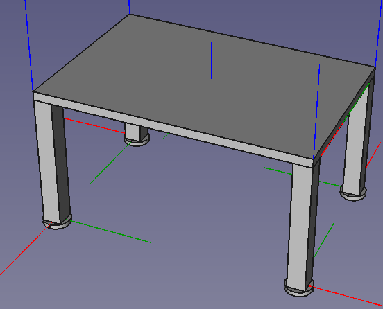

Summary
===============
We need a total of nine parts to assemble the table: four legs, four feet and a table top.  We could add each of these nine individually, but it is much faster - and easier to update - if we include the leg and foot together as a sub-assembly.

To do this, we need to add a Local Co-ordinate System to the leg, and import it into the leg/foot subassembly for use in the finished product.

Bonus exercise:
=================

Now that we have used the LCS in the *LegFootAssembly* to position the parts on the *TableTop*, moving them is very simple:

Activate the *Leg* file.

Right-click on LCS\_TopCorner and select "Edit datum":

Move the LCS out from the Body with an offset of -10mm in the X and Y directions:

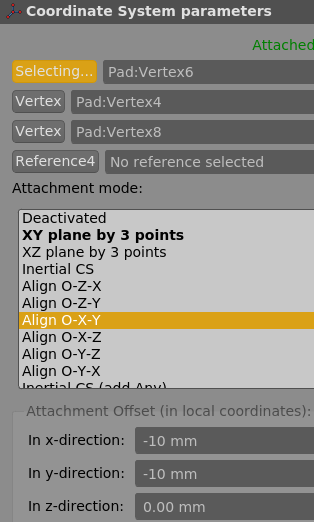

Click OK.

As this is the point that is attached to the *TableTop*, the legs will move inwards.

Activate the *TableAssembly* file and click the "Update Assembly"  button on the Assembly 4 workbench toolbar.

The four legs now move in under the table slightly as shown.
We adjust LCS positions by rotating or translating on any axis as needed, making this a good modular design.